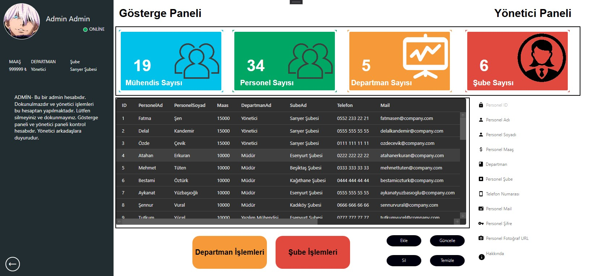
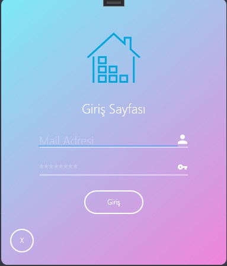
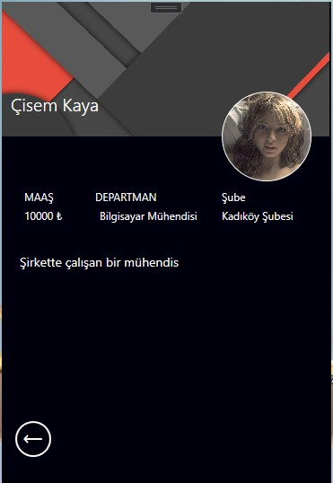

# C# Wpf Şirket Projesi
 SQL Backup dosyası dosya içeriğinde mevcuttur. Kullanıcı sayfası ve yönetici sayfası olmak üzere proje 2 bölümden oluşmaktadır.
 Projede Entity Framework teknolojisinden yararlanılmıştır. C#'ın WPF teknolojisi ve UI Tasarımı kullanılmıştır.
 C# Form tasarımları WPF tarafında kodlanmıştır. Üniversite zamanı aldığımız eğitim sonucu oluşturmuş olduğum 5 projeden birisidir. 
 Uygulamanın tam hali için;

 ### Benimle İletişime Geç

&nbsp;&nbsp;

&nbsp;&nbsp;

# Tasarım 

&nbsp;&nbsp;

&nbsp;&nbsp;

